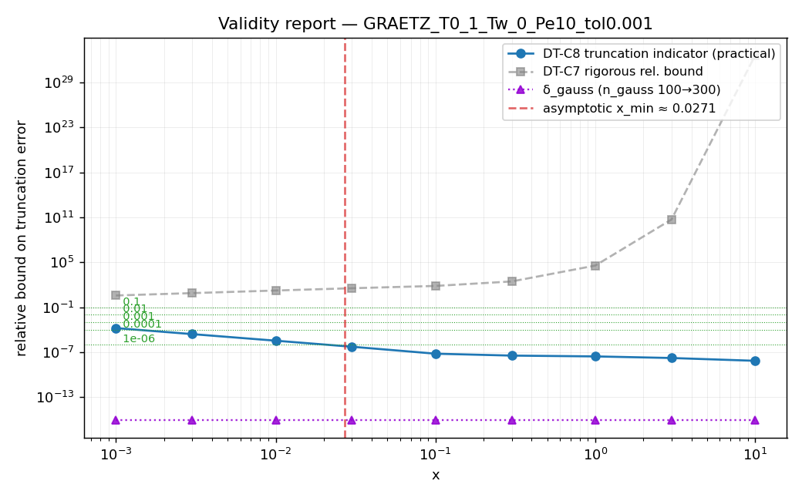

# Correction Validity Report — GRAETZ_T0_1_Tw_0_Pe10_tol0.001

Generated by [tests/run_validity_report.py](run_validity_report.py).
See [tests/CORRECTION_VALIDITY_GUIDE.md](CORRECTION_VALIDITY_GUIDE.md) for the theory underpinning each number.

## Configuration

- Solution: `CDGraetzIsothermalSolution`
- `T0`: 1.0
- `T_wall`: 0.0
- Péclet: **10**
- Coefficient-fixing `x0`: **0.0001**
- Truncation tolerance `tol`: **0.001**
- Gauss points (inlet projection): 100
- Active modes after correction-aware extension: **K_full = 100**
- DT-C8 proxy K_sub = 75 (75% of K_full)
- Smallest active eigenvalue: **β_min = 2.70436**, β_min² = 7.31359

## 1. Asymptotic-validity (Phase 3.4)

Expansion parameter at x = x0:  4 e⁻² / (Pe² · x0) = **54.13**

**Verdict: CRITICAL** — above 1 — the asymptotic expansion itself is suspect at x0. Truncation analysis below is only meaningful for x > 0.0271.

For your Pe, the expansion is in its valid regime at x ≳ **0.02707** (where 4 e⁻² / (Pe² x) < 0.2).

## 2. Truncation behaviour across x

Columns:
- `‖correction‖_ω` — magnitude of the truncated correction in the energy norm.
- `DT-C8 trunc. indicator` — `‖correction(K_proxy) − correction(K_full)‖_ω / ‖correction(K_full)‖_ω`. **This is the practical answer**.
- `DT-C7 rigorous rel. bound` — Gronwall a-posteriori upper bound divided by `‖correction‖_ω`. Rigorous but typically loose for stepped inlets.
- `DT-C6 relative PDE residual` — local closure defect; mostly diagnostic.

| x | ‖correction‖_ω | DT-C8 trunc. indicator | DT-C7 rigorous rel. bound | DT-C6 relative PDE residual |
|---|---|---|---|---|
| 0.001 | 15.53 | 0.0001704 | 3.78 | 0.03039 |
| 0.003 | 7.489 | 2.667e-05 | 7.838 | 0.01455 |
| 0.01 | 3.385 | 3.541e-06 | 17.34 | 0.006501 |
| 0.03 | 1.672 | 5.537e-07 | 35.12 | 0.003115 |
| 0.1 | 0.8275 | 6.536e-08 | 70.94 | 0.00138 |
| 0.3 | 0.2083 | 3.641e-08 | 281.8 | 0.0008743 |
| 1 | 0.001599 | 2.834e-08 | 3.67e+04 | 0.0008739 |
| 3 | 1.16e-09 | 1.736e-08 | 5.061e+10 | 0.0008739 |
| 10 | 1.595e-31 | 7.367e-09 | 3.68e+32 | 0.0008739 |

## 3. Recommended x_min for several tolerances

- `x_min (truncation)` is the smallest x in the grid where the DT-C8 indicator is below tolerance.
- `x_min (asymptotic)` is the threshold from §1.
- `x_min (combined)` = `max(truncation, asymptotic)` — use this for the FEM comparison.

| Tolerance | x_min (truncation) | x_min (asymptotic) | **x_min (combined)** |
|---|---|---|---|
| 0.1 | 0.001 | 0.02707 | 0.0270671 |
| 0.01 | 0.001 | 0.02707 | 0.0270671 |
| 0.001 | 0.001 | 0.02707 | 0.0270671 |
| 0.0001 | 0.003 | 0.02707 | 0.0270671 |
| 1e-06 | 0.03 | 0.02707 | 0.03 |

## 4. Interpretation

At 1 % tolerance the correction is trustworthy for **x ≳ 0.0270671**, limited by *asymptotic-expansion validity*.

Folding in the §5 precision study, the **overall** x_min to target for FEM comparisons at 1 % tolerance is **x ≳ 0.0270671** (max of asymptotic, truncation, and inlet-projection convergence).

For FEM-vs-corrected comparisons, target `x ≥ x_min(combined)` from the table above; the FEM result and the corrected analytical solution should agree within the tolerance you picked.

**Caveats** (see CORRECTION_VALIDITY_GUIDE.md §4 and §5):
- DT-C7's rigorous bound is dominated by the worst residual at small x and is usually 100× looser than the actual truncation error, so do not use the rigorous-relative-bound column for decision-making — DT-C8 is the practical answer.
- The asymptotic threshold is heuristic (4 e⁻² / (Pe² x) < 0.2). It does not bound the asymptotic error rigorously; it only flags when the expansion parameter starts being O(1).
- The bound covers truncation + quadrature only; the asymptotic O(Pe⁻²) tail of the perturbation expansion is **not** measured by these diagnostics.

## 5. Numerical-precision convergence study

Each row shows the relative L²_ω change in the correction field when the inlet-projection quadrature is sharpened (`n_gauss_points` 100 → 300). A value below your target tolerance means the inlet projection is converged at that x.

| x | δ_gauss (nq → nq·factor) |
|---|---|
| 0.001 | 0 |
| 0.003 | 0 |
| 0.01 | 0 |
| 0.03 | 0 |
| 0.1 | 0 |
| 0.3 | 0 |
| 1 | 0 |
| 3 | 0 |
| 10 | 0 |

**Implementation-precision x_min** (smallest x where δ_gauss is below the listed tolerance):

| Tolerance | x_min(precision) |
|---|---|
| 0.1 | 0.001 |
| 0.01 | 0.001 |
| 0.001 | 0.001 |
| 0.0001 | 0.001 |
| 1e-06 | 0.001 |

### Roots-table usage

- Active modes after correction-aware extension: **K_full = 100** (sum across all Bessel orders).
- Precomputed roots/norms table ships at **100 modes per Bessel order** (`broots_100x100.h`).
- The authoritative table-saturation signal is the `[Peclet] Warning: n=X correction may need β>… but table only goes to …` line printed to stderr during solver construction (scroll up in your shell). If it fired for *any* n, the table — not your `tol` — is the binding mode cutoff for that order; extending the table via `write_roots_and_norms` in [src/main.cpp](../../src/main.cpp) would let you tighten `tol` further. If it did not fire, your `tol` is the active constraint.

