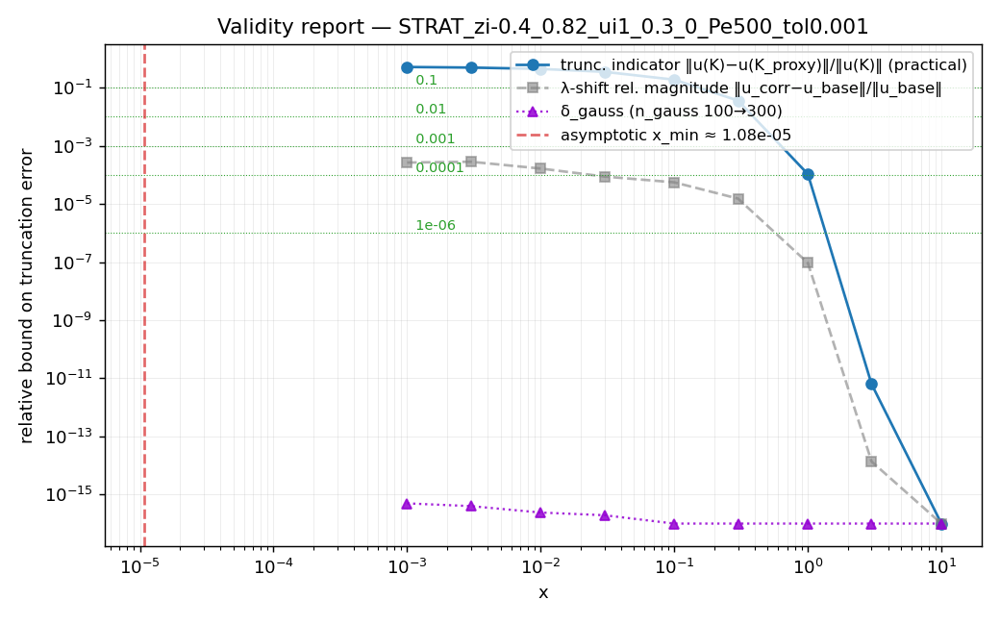

# Correction Validity Report — STRAT_zi-0.4_0.82_ui1_0.3_0_Pe500_tol0.001

Generated by [tests/run_validity_report.py](run_validity_report.py).
See [tests/CORRECTION_VALIDITY_GUIDE.md](CORRECTION_VALIDITY_GUIDE.md) for the theory underpinning each number.

## Configuration

- Solution: `CDStratifiedSolution`
- `zi`: [-0.4, 0.82]
- `ui`: [1.0, 0.3, 0.0]
- Péclet: **500**
- Coefficient-fixing `x0`: **0.01**
- Truncation tolerance `tol`: **0.001**
- Gauss points (inlet projection): 100
- Active modes: **K_full = 63**
- Truncation-study proxy: K_proxy = 47 (75% of K_full)
- Smallest active eigenvalue: **β_min = 2.88463**, β_min² = 8.32107

## 1. Asymptotic-validity (Phase 3.4)

Expansion parameter at x = x0:  4 e⁻² / (Pe² · x0) = **0.0002165**

**Verdict: OK** — below 0.2 — asymptotic expansion is in its valid regime at x0.

For your Pe, the expansion is in its valid regime at x ≳ **1.083e-05** (where 4 e⁻² / (Pe² x) < 0.2).

## 2. Truncation behaviour across x

> **Note — Finite-Peclet approximation**: each mode decays as exp(−Λ_k x) where Λ_k is the positive root of κ α_k Λ² + Λ − β_k² = 0 (κ = Pe⁻², α_k = P_kk/N_k²). This uses the diagonal approximation of the QEP — off-diagonal couplings between modes are neglected. See §7 of the derivation notes for the known limitation.

Columns:
- `‖u_corrected‖_ω` — L²_ω norm of the corrected solution field at this x.
- `trunc. indicator` — `‖u(K_full) − u(K_proxy)‖_ω / ‖u(K_full)‖_ω` where K_proxy ≈ 75% of modes. **Use this to judge series convergence**.
- `λ-shift rel. magnitude` — `‖u_corrected − u_base‖_ω / ‖u_base‖_ω`, where u_base is the Pe=∞ solution. Shows how large the Péclet correction is.

| x | ‖u_corrected‖_ω | trunc. indicator | λ-shift rel. magnitude |
|---|---|---|---|
| 0.001 | 0.6242 | 0.5137 | 0.0002645 |
| 0.003 | 0.6147 | 0.4909 | 0.0002821 |
| 0.01 | 0.5967 | 0.441 | 0.0001646 |
| 0.03 | 0.5719 | 0.3507 | 8.741e-05 |
| 0.1 | 0.5453 | 0.1882 | 5.526e-05 |
| 0.3 | 0.5359 | 0.03594 | 1.523e-05 |
| 1 | 0.5355 | 0.0001063 | 9.31e-08 |
| 3 | 0.5355 | 6.301e-12 | 1.366e-14 |
| 10 | 0.5355 | 0 | 0 |

## 3. Recommended x_min for several tolerances

- `x_min (truncation)` is the smallest x in the grid where the DT-C8 indicator is below tolerance.
- `x_min (asymptotic)` is the threshold from §1.
- `x_min (combined)` = `max(truncation, asymptotic)` — use this for the FEM comparison.

| Tolerance | x_min (truncation) | x_min (asymptotic) | **x_min (combined)** |
|---|---|---|---|
| 0.1 | 0.3 | 1.083e-05 | 0.3 |
| 0.01 | 1 | 1.083e-05 | 1 |
| 0.001 | 1 | 1.083e-05 | 1 |
| 0.0001 | 3 | 1.083e-05 | 3 |
| 1e-06 | 3 | 1.083e-05 | 3 |

## 4. Interpretation

At 1 % tolerance the correction is trustworthy for **x ≳ 1**, limited by *mode truncation*.

Folding in the §5 precision study, the **overall** x_min to target for FEM comparisons at 1 % tolerance is **x ≳ 1** (max of asymptotic, truncation, and inlet-projection convergence).

For FEM-vs-corrected comparisons, target `x ≥ x_min(combined)` from the table above; the FEM result and the corrected analytical solution should agree within the tolerance you picked.

**Caveats**:
- The truncation indicator uses K_proxy ≈ 75% of modes. It underestimates the true error if the omitted 25% contribute significantly; tighten `tol` or raise `max_root` if the indicator looks large.
- The asymptotic threshold is heuristic (4 e⁻² / (Pe² x) < 0.2). It does not bound the asymptotic error rigorously; it only flags when the expansion parameter starts being O(1).
- **Diagonal QEP approximation (known limitation)**: Λ_k is computed from the diagonal of the quadratic eigenvalue problem. Off-diagonal mode couplings (P_{kl}, k≠l) are neglected. The full QEP would require an O(K³) solve and is not implemented. The approximation is exact when modes are orthogonal under the r-weight and progressively less accurate when Pe is small enough that the coupling terms are O(1). See the FUTURE note in `CDBaseSolution.tpp::compute_corrected_rates` for details.

## 5. Numerical-precision convergence study

Each row shows the relative L²_ω change in the correction field when the inlet-projection quadrature is sharpened (`n_gauss_points` 100 → 300). A value below your target tolerance means the inlet projection is converged at that x.

| x | δ_gauss (nq → nq·factor) |
|---|---|
| 0.001 | 4.957e-16 |
| 0.003 | 3.992e-16 |
| 0.01 | 2.397e-16 |
| 0.03 | 1.937e-16 |
| 0.1 | 9.039e-17 |
| 0.3 | 4.399e-17 |
| 1 | 5.119e-20 |
| 3 | 0 |
| 10 | 0 |

**Implementation-precision x_min** (smallest x where δ_gauss is below the listed tolerance):

| Tolerance | x_min(precision) |
|---|---|
| 0.1 | 0.001 |
| 0.01 | 0.001 |
| 0.001 | 0.001 |
| 0.0001 | 0.001 |
| 1e-06 | 0.001 |

### Roots-table usage

- Active modes after correction-aware extension: **K_full = 63** (sum across all Bessel orders).
- Precomputed roots/norms table ships at **100 modes per Bessel order** (`broots_100x100.h`).
- The authoritative table-saturation signal is the `[Peclet] Warning: n=X correction may need β>… but table only goes to …` line printed to stderr during solver construction (scroll up in your shell). If it fired for *any* n, the table — not your `tol` — is the binding mode cutoff for that order; extending the table via `write_roots_and_norms` in [src/main.cpp](../../src/main.cpp) would let you tighten `tol` further. If it did not fire, your `tol` is the active constraint.

